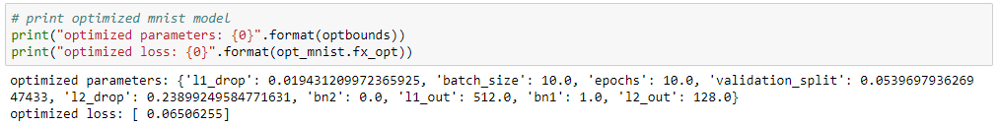
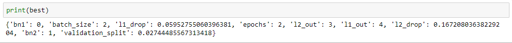

# keras_opt
Autotuning hyperparameters for Keras.
The repository provides implementing autotuning deep learning hyper parameters using Keras with various optimization libraries.
Major methods of hyper parameter tuning include [GridSearchCV](http://scikit-learn.org/stable/modules/generated/sklearn.model_selection.GridSearchCV.htmlhttp://scikit-learn.org/stable/modules/generated/sklearn.model_selection.GridSearchCV.html) and [RandomSearchCV](http://scikit-learn.org/stable/modules/generated/sklearn.model_selection.GridSearchCV.html) of Scikit-learn, while there are other methods that are quite more sophisticated than these.

## Autotuning
I implemented hyper parameter tunings with these methods.
1. Bayesian optimization, using [GPyOpt](https://sheffieldml.github.io/GPyOpt/)
2. SMBO TEP, using [HyperOpt](https://github.com/hyperopt/hyperopt)
3. Genetic Algorithm, using [DEAP](http://deap.readthedocs.io/en/master/index.html)

The neural network going to be tuned is MNIST with one input layer, two hidden layers and one output layers.
The tuners are going to explore and exploit the best values for these parameters:
- number of neurons in hidden layer1
- number of neurons in hidden layer2
- dropout rate of hidden layer1
- dropout rate of hidden layer2
- whether to have batchnormalization after hidden layer1
- whether to have batchnormalization after hidden layer2
- batch size
- epoch size
- validation split rate

## Results
These are the results:
1. [Bayesian optimization](./bopt_nn.ipynb):

2. [SMBO TPE](./tpe_nn.ipynb):

3. [Genetic Algorithm](./ga_nn.ipynb):

